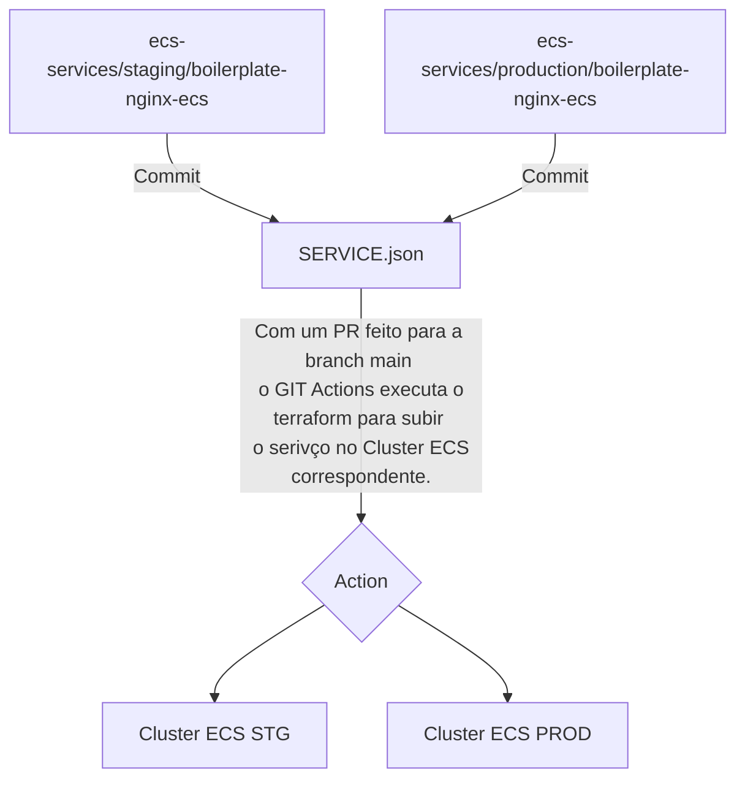

```mermaid
flowchart TD;
    A1[ecs-services/staging/boilerplate-nginx-ecs] -->|Commit| B;
    A2[ecs-services/production/boilerplate-nginx-ecs] -->|Commit| B;
    B[SERVICE.json] -->|Com um PR feito para a branch main <br> o GIT Actions executa o terraform para subir <br> o serivço no Cluster ECS correspondente.| C{Action}
    C --> D[Cluster ECS STG];
    C --> F[Cluster ECS PROD];
```
